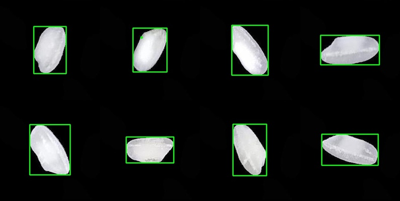
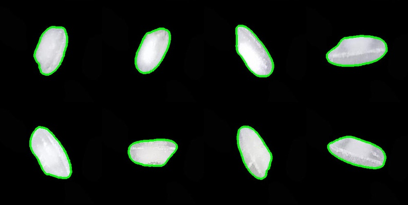
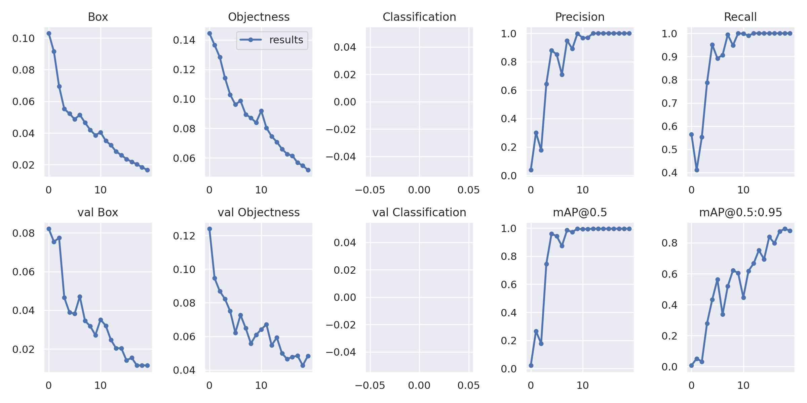

# 75000 Rice Image Dataset for Object Detection and Object Segmentation

## Intro
Rice is the seed of the grass species Oryza sativa or, less commonly, Oryza glaberrima. Wild rice is usually used for species of the genera Zizania and Porteresia, both wild and domesticated. However, primitive or uncultivated varieties of Oryza may also use this name.

### Popular Types of Rice
1. Basmati Rice
2. Jasmine Rice
3. Wild Rice
4. Calrose Rice
5. Japanese Short-Grain Rice (uruchimai 粳米)
6. Sushi Rice
7. Japanese Glutinous (Sticky) Rice
8. Arborio Rice 
9. Black Rice
10. Medium-Grain Brown Rice
11. Valencia Rice
12. Red Rice
13. Rice Blends
14. Parboiled Rice

## Data
### About The Original Data
Originally, [Murat Koklu](https://www.kaggle.com/muratkokludataset) published the images on [Kaggle](https://www.kaggle.com/) under a [CC0: Public Domain](https://creativecommons.org/publicdomain/zero/1.0/) license. Images are available in the following link [Rice Image Dataset](https://www.kaggle.com/datasets/muratkokludataset/rice-image-dataset).

The original data contains images of 5 Different Types of Rice, and each type includes 15000 images bringing the total to 75000. 

### About the Annotated Data
An Automatic Annotator Script was developed in Python to prepare the Images for Object Detection and Segmentation. Because the annotations were created Automatically, they have a High Degree of Accuracy.

The Annotations are in [LabelMe](https://github.com/wkentaro/labelme) [JSON](https://www.json.org/json-en.html) format. Annotation JSONs also contain the encoded version of the images that can be used to recreate the images if the need arises. 

75000 Rice Images Annotated for Object Detection can be downloaded using [this link](https://www.kaggle.com/datasets/alikhalilit98/rice-image-dataset-for-object-detection).

  

75000 Rice Images Annotated for Object Segmentation can be downloaded using [this link](https://www.kaggle.com/datasets/alikhalilit98/rice-image-dataset-for-object-segmentation).

  

## Tests Done
A few tests were also done using the annotated images. A Small Version of [YOLOv5](https://github.com/ultralytics/yolov5) Object Detection Model was selected for one of the tests. For this test, The Basmati Rice Images were combined in grids of 4 * 4, bringing the total sum to around 900. The images were also resized to 512px.
The batch size of the model was 12, and it was trained for 20 Epochs. Training Results are Shown in the Figure Below:

  

A few Thai White Rice Images were gathered in real-world scenarios(e.g., Lighting) using a 16MP Phone Camera to test the model. Test images were then Resized to 2024px. With this image size, inference took approximately 1 second.
Below Figure is one of the test outputs at Conf 0.8.

  

## Questions
It is possible to use the annotations after resizing or combining the images; however, the annotations should be mapped manually. Another option is to re-annotate the images. So If you need any help modifying the images or annotating your modified images, send me a message on my [LinkedIn](https://www.linkedin.com/in/ali-khalili-790b10146/) account. 

## License
 This work is licensed under a <a rel="license" href="http://creativecommons.org/licenses/by/4.0/">Creative Commons Attribution 4.0 International License</a>.

## Contact
For any questions, concerns, or collaboration opportunities, please don't hesitate to contact me on my [LinkedIn](https://www.linkedin.com/in/ali-khalili-790b10146/) account.
